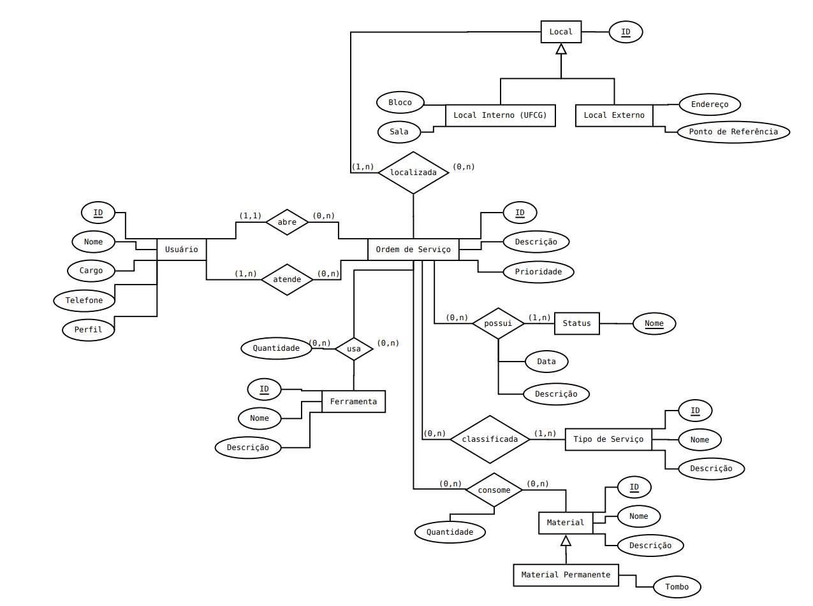
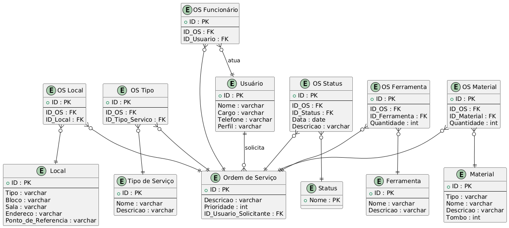

# Sistema de Gestão de Ordens de Serviço

Este projeto é uma aplicação de gerenciamento de ordens de serviço, desenvolvida em Java com o framework **Spring Boot** e utilizando **JPA** para persistência de dados. O sistema permite o gerenciamento de usuários, locais, ferramentas, materiais e o acompanhamento de ordens de serviço.

## Funcionalidades
- Cadastro de **usuários** e gerenciamento de seus perfis e contatos.
- Registro e acompanhamento de **ordens de serviço** com diferentes prioridades e descrições.
- Cadastro de **ferramentas** e **materiais** utilizados nas ordens de serviço.
- Gestão de **locais** onde os serviços serão realizados (interno ou externo).
- Acompanhamento do **status** de cada ordem de serviço (aberta, em andamento, concluída, cancelada).
- Controle de **tipos de serviço** e seus detalhes.
- Associação de funcionários, locais, ferramentas, materiais e tipos de serviço às ordens de serviço.

## Modelagem do Sistema

### Entidades

#### Usuário
Entidade responsável por representar os usuários do sistema.
- `id`: Identificador único do usuário.
- `nome`: Nome completo do usuário.
- `cargo`: Cargo ou função do usuário.
- `telefone`: Telefone de contato.
- `perfil`: Perfil do usuário no sistema (ex.: ADMIN, USER).

#### Ordem de Serviço
Entidade que representa uma ordem de serviço registrada no sistema.
- `id`: Identificador único da ordem.
- `descricao`: Descrição da ordem de serviço.
- `prioridade`: Prioridade da ordem (alta, média, baixa).
- `usuarioSolicitante`: Referência ao usuário que solicitou a ordem de serviço.

#### Local
Entidade que define os locais onde os serviços podem ser realizados.
- `id`: Identificador único do local.
- `tipo`: Tipo de local (interno ou externo).
  - Locais internos **não têm** endereço nem ponto de referência.
  - Locais externos **não têm** bloco nem sala.
- `bloco`: Bloco do local (somente para locais internos).
- `sala`: Sala do local (somente para locais internos).
- `endereco`: Endereço completo (somente para locais externos).
- `pontoDeReferencia`: Ponto de referência (somente para locais externos).

#### Ferramenta
Entidade que representa as ferramentas utilizadas nas ordens de serviço.
- `id`: Identificador único da ferramenta.
- `nome`: Nome da ferramenta.
- `descricao`: Descrição da ferramenta.

#### Tipo de Serviço
Entidade que define os tipos de serviço disponíveis no sistema.
- `id`: Identificador único do tipo de serviço.
- `nome`: Nome do tipo de serviço (ex.: manutenção corretiva, preventiva).
- `descricao`: Descrição do tipo de serviço.

#### Status
Entidade que representa o status atual de uma ordem de serviço.
- `nome`: Nome do status (aberta, em andamento, concluída, cancelada).

#### Material
Entidade que define os materiais utilizados nas ordens de serviço.
- `id`: Identificador único do material.
- `nome`: Nome do material.
- `tipo`: Tipo de material (consumo ou permanente).
  - Materiais do tipo **consumo** **não têm** número de tombo.
- `descricao`: Descrição do material.
- `tombo`: Número de tombo (somente para materiais do tipo permanente).

#### OSFuncionário
Entidade que associa um funcionário a uma ordem de serviço.
- `id`: Identificador único da associação.
- `ordemDeServico`: Referência à ordem de serviço.
- `usuario`: Referência ao usuário (funcionário).

#### OSLocal
Entidade que associa um local a uma ordem de serviço.
- `id`: Identificador único da associação.
- `ordemDeServico`: Referência à ordem de serviço.
- `local`: Referência ao local.

#### OSFerramenta
Entidade que associa uma ferramenta a uma ordem de serviço.
- `id`: Identificador único da associação.
- `ordemDeServico`: Referência à ordem de serviço.
- `ferramenta`: Referência à ferramenta.
- `quantidade`: Quantidade de ferramentas utilizadas.

#### OSTipo
Entidade que associa um tipo de serviço a uma ordem de serviço.
- `id`: Identificador único da associação.
- `ordemDeServico`: Referência à ordem de serviço.
- `tipoDeServico`: Referência ao tipo de serviço.

#### OSStatus
Entidade que associa um status e uma data a uma ordem de serviço.
- `id`: Identificador único da associação.
- `ordemDeServico`: Referência à ordem de serviço.
- `status`: Referência ao status.
- `data`: Data em que o status foi atualizado.
- `descricao`: Descrição adicional sobre o status.

#### OSMaterial
Entidade que associa materiais a uma ordem de serviço.
- `id`: Identificador único da associação.
- `ordemDeServico`: Referência à ordem de serviço.
- `material`: Referência ao material.
- `quantidade`: Quantidade de material utilizado.

## Regras de Negócio
1. Materiais do tipo **consumo** não possuem número de tombo.
2. Locais do tipo **interno** não possuem endereço e ponto de referência.
3. Locais do tipo **externo** não possuem bloco e sala.

## MER (Modelo Entidade-Relacionamento)
Aqui você pode adicionar uma imagem ou um link para o **MER** do projeto.

---

## DER (Diagrama Entidade-Relacionamento)
Aqui você pode adicionar uma imagem ou um link para o **DER** do projeto.

---

## Tecnologias Utilizadas
- **Java 17**: Linguagem de programação.
- **Spring Boot**: Framework para o desenvolvimento da aplicação.
- **Spring Data JPA**: Persistência de dados.
- **Hibernate**: Implementação do JPA para o mapeamento objeto-relacional.
- **H2 Database**: Banco de dados em memória para desenvolvimento e testes.
- **JUnit 5**: Testes automatizados.
